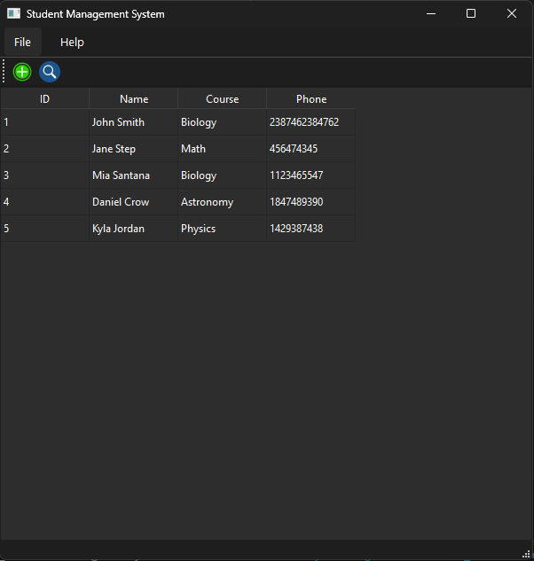

# Student Management System (GUI - SQL)

Simple GUI app, which serves to store data (ID, Name, Course, Phone) from students who enroll in an academic program. SQlite is used to store student data in SQL, and PyQt6 is used to create the user interface.

This app has been developed during the Python Mega Course by Ardit Sulce. It can be expanded by adding more columns to hold student data (such as a photo, address, or email), handling errors, adding a SQL table for the courses, etc.

