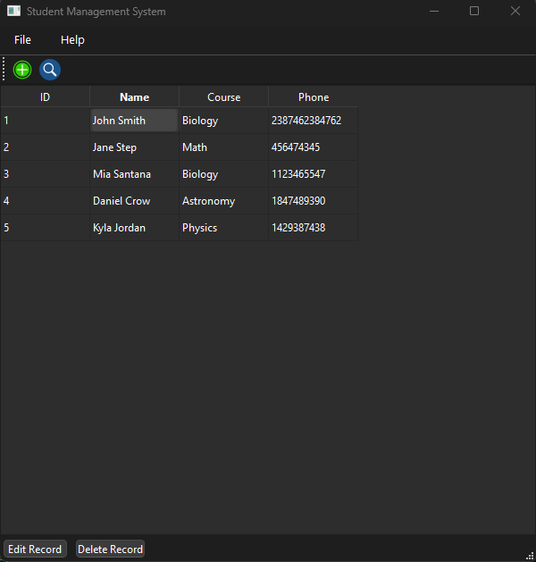

# Student Management System (GUI - SQL)

Simple GUI app, which serves to store data (ID, Name, Course, Phone) from students who enroll in an academic program. SQlite is used to store student data in SQL, and PyQt6 is used to create the user interface.

Using a straightforward graphical user interface on the desktop, the desktop application can be used as a student management system, allowing the user to add, modify, delete, and search students.

### Screenshot

